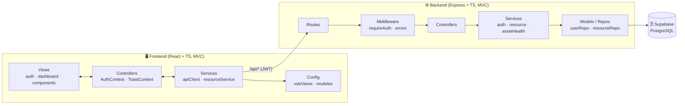

<div align="center">

# 💧 FlowGuard

### Integrated Inventory and Asset Lifecycle Management System for Maynilad‑Boac

A centralized, web‑based platform that replaces the manual and semi‑manual operations of **Maynilad‑Boac (Amayi Water Solutions, Inc.)** — unifying **incident management, job orders, inventory, asset lifecycle monitoring, and service advisories** into one real‑time, role‑based system.


-3ecf8e)


</div>

---

## 📑 Table of Contents

1. [Project Overview](#-project-overview)
2. [The Problem](#-the-problem-existing-system)
3. [Objectives](#-objectives)
4. [Core Modules & Features](#-core-modules--features)
5. [Tech Stack](#-tech-stack)
6. [System Architecture](#-system-architecture)
7. [Project Structure](#-project-structure)
8. [Database Schema](#-database-schema)
9. [Roles & Permissions](#-roles--permissions)
10. [Asset Health Scoring](#-asset-health-scoring)
11. [API Reference](#-api-reference)
12. [Setup Guide (Step‑by‑Step)](#-setup-guide-step-by-step)
13. [Environment Variables](#-environment-variables)
14. [Demo Accounts](#-demo-accounts)
15. [NPM Scripts](#-npm-scripts)
16. [Verification & Testing](#-verification--testing)
17. [Security Notes](#-security-notes)
18. [Roadmap & Limitations](#-roadmap--limitations)
19. [Authors](#-authors)

---

## 🌊 Project Overview

**FlowGuard** is a capstone system for **Maynilad‑Boac**, the water utility serving the 41 barangays of Boac, Marinduque under a 25‑year concession agreement. The organization currently relies on **paper documents, logbooks, text messaging, and social‑media posts** to run daily operations, causing poor traceability, reactive decision‑making, stock shortages, and slow communication.

FlowGuard digitizes these processes into a single web platform accessible from phones and computers, providing:

- **Real‑time monitoring** of inventory and asset lifecycles
- **Coordinated job order & incident management** across departments
- **Automated service advisories** with notifications
- **Asset Health Scoring** for predictive/preventive maintenance
- **Role‑based dashboards** for every type of user

> Built from the research paper *"FlowGuard: Integrated Inventory and Asset Lifecycle Management System for Maynilad Boac"* and evaluated against the **ISO/IEC 25010** software quality model.

---

## 🔴 The Problem (Existing System)

| Area | Current manual process | Pain points |
| --- | --- | --- |
| **Job Order & Incident** | Verbal complaints → paper JOAR / MRF / RMS, multi‑department approvals | No traceability, poor coordination, manual SMS updates |
| **Inventory** | Warehouseman records stock in logbooks; physical count once a year | No real‑time stock; shortages discovered too late; reactive purchasing |
| **Asset Lifecycle** | Visual inspection only; no record of install dates / maintenance | Failures found only after breakdown; no preventive maintenance |
| **Service Advisory** | Social‑media posts + printed *“pabatid”* letters hand‑delivered | Delayed dissemination, no confirmation, inconsistent reach |

---

## 🎯 Objectives

**General:** Develop a web‑based system to improve the manual and semi‑manual processes of job order & incident management, inventory management, asset lifecycle monitoring, and service advisory dissemination.

**Specific:**
1. Improve interdepartmental coordination to record and monitor **job orders**.
2. Provide efficient, timely tracking of **service requests / customer complaints**.
3. Enable create / update / manage of **inventory records** with real‑time monitoring.
4. Track **assets** via unique identifiers (install details, maintenance records, condition).
5. Deliver **real‑time notifications** and efficient **service advisories**.

---

## 🧩 Core Modules & Features

FlowGuard implements **6 operational modules** + a reporting dashboard, each backed by live Supabase data.

### 1. 👤 User Management
- Registration, login, JWT‑based sessions
- Role assignment (5 roles)
- Admin **user directory** (General Manager only)

### 2. 📣 Incident Management
- File complaints (leak, low pressure, new connection, disconnection, other)
- Status workflow: **Under Verification → In Progress → Scheduled → Resolved**
- Urgency tagging (low / medium / high), customer self‑tracking, summary metrics

### 3. 🛠️ Job Order Management
- Create job orders (optionally linked to an incident)
- Assign to **In‑house Team** or **Contractor**, estimate cost, schedule date
- Status workflow: **Pending → In Progress → Completed / Cancelled**

### 4. 📦 Inventory Management
- Full CRUD on materials (name, category, SKU, quantity, unit price, supplier, source)
- **Low‑stock** & **defective** tracking, real‑time inventory value
- **Material Requests (MRF)**: request → **Approve → Release / Reject**

### 5. 🏗️ Asset Lifecycle Monitoring
- Register assets (pipes, pumps, meters, valves) with install date, location, lifespan
- Maintenance history & condition tracking
- **Asset Health Scoring** (signature feature) — see [below](#-asset-health-scoring)

### 6. 📢 Service Advisory Management
- Create advisories (maintenance / interruption / emergency)
- Approval flow: **Draft → Approved → Published** (GM approval)
- Customers view **published** advisories only

### 7. 📊 Reporting / Dashboards
- Per‑role dashboards with live metrics, charts, and operational tables

---

## 🧱 Tech Stack

| Layer | Technology |
| --- | --- |
| **Frontend** | React 18, TypeScript, Vite, React Router, lucide‑react (icons) |
| **Backend** | Node.js, Express 4, TypeScript |
| **Database** | Supabase (PostgreSQL) via `@supabase/supabase-js` |
| **Auth** | JWT (`jsonwebtoken`) + bcrypt password hashing (`bcryptjs`) |
| **Styling** | Hand‑crafted CSS design system (blue palette, glassmorphism) |
| **Tooling** | `tsx` (dev), `concurrently`, `dotenv` |

---

## 🏛️ System Architecture

Both apps follow a clean **MVC** separation.



**Request lifecycle:** `View → resourceService → /api/resources/:entity → requireAuth → controller → resource.service (role check + validation) → resourceRepo → Supabase`.

### Backend (MVC)

| Layer | Folder | Responsibility |
| --- | --- | --- |
| **Model** | `src/models` | Domain types, Supabase admin client, `userRepo`, generic `resourceRepo`, in‑memory `store` (fallback + seeded dashboards). |
| **Service** | `src/services` | Business logic — `auth.service` (hash/JWT/validation), `resource.service` (role checks, sanitization, auto keys, error mapping), `assetHealth`. |
| **Controller** | `src/controllers` | Thin HTTP adapters. |
| **Routes** | `src/routes` | `auth`, `dashboard`, `resources`, `users`. |
| **Middleware** | `src/middleware` | JWT auth, centralized error handling. |
| **Config** | `src/config` | `env`, resource **registry** (`resources.ts`). |

### Frontend (MVC)

| Layer | Folder | Responsibility |
| --- | --- | --- |
| **Model** | `src/models` | Types mirroring the API contract. |
| **Service** | `src/services` | `apiClient` (fetch + JWT), `resourceService`, `authService`, `dashboardService`. |
| **Controller** | `src/controllers` | React context providers (`AuthContext`, `ToastContext`). |
| **View** | `src/views` | `auth/`, `dashboard/`, shared `components/` incl. the generic **`LiveModule`**. |
| **Config** | `src/config` | `roleViews.tsx` (per‑role nav/views) + `modules.tsx` (one wrapper per operational module). |

> **Key idea:** A single generic `LiveModule` (fetch + metrics + table + create/edit modal + row actions) is configured per entity in `modules.tsx`, then slotted into each role's dashboard via `roleViews.tsx`. Adding a module is configuration, not new plumbing.

---

## 📁 Project Structure

```
maynilad/
├── backend/                         # Express + TypeScript API
│   ├── supabase/
│   │   └── schema.sql               # All tables + RLS + seed data (idempotent)
│   ├── scripts/
│   │   └── migrate.mjs              # One‑shot migration runner (Management API)
│   └── src/
│       ├── config/
│       │   ├── env.ts               # Centralized env (incl. Supabase)
│       │   └── resources.ts         # Resource registry (tables, roles, validation)
│       ├── controllers/             # auth · dashboard · resource
│       ├── middleware/              # auth.middleware · error.middleware
│       ├── models/
│       │   ├── supabase.ts          # Service‑role admin client
│       │   ├── userRepo.ts          # User data access (Supabase + in‑memory fallback)
│       │   ├── resourceRepo.ts      # Generic CRUD against any table
│       │   ├── store.ts · seed.ts   # In‑memory store + seed dashboards
│       │   └── types.ts             # Domain model
│       ├── routes/                  # auth · dashboard · resources · users
│       ├── services/
│       │   ├── auth.service.ts      # register / login / verify
│       │   ├── resource.service.ts  # role checks, sanitize, auto keys, errors
│       │   ├── assetHealth.ts       # Asset Health Scoring
│       │   └── dashboard.service.ts
│       ├── utils/                   # httpError · asyncHandler
│       ├── app.ts · server.ts       # App assembly + entry point
│       └── .env.example
├── frontend/                        # Vite + React + TypeScript SPA
│   ├── index.html
│   └── src/
│       ├── config/
│       │   ├── roleViews.tsx        # Per‑role sidebar + views
│       │   ├── modules.tsx          # Live operational module configs
│       │   └── modals.ts
│       ├── controllers/             # AuthContext · ToastContext
│       ├── models/types.ts
│       ├── services/                # apiClient · resourceService · auth · dashboard
│       ├── styles/                  # index · auth · dashboard CSS
│       └── views/
│           ├── auth/                # AuthCard · LoginPage · SignupPage · PasswordInput
│           ├── dashboard/           # DashboardPage · Sidebar · Topbar
│           └── components/          # LiveModule · DataTable · Modal · MetricsGrid · …
├── legacy/                          # Original static prototype (reference)
└── package.json                     # Root scripts to run both apps together
```

---

## 🗄️ Database Schema

PostgreSQL tables in Supabase (`public` schema). All have **Row Level Security enabled**; the backend uses the **service‑role key** (bypasses RLS) for trusted access. Full DDL + seed in [`backend/supabase/schema.sql`](backend/supabase/schema.sql).

### `app_users`
| Column | Type | Notes |
| --- | --- | --- |
| `id` | uuid (PK) | `gen_random_uuid()` |
| `full_name` | text | |
| `email` | text | unique |
| `role` | text | enum of 5 roles |
| `password_hash` | text | bcrypt |
| `created_at` | timestamptz | |

### `incidents`
`id`, `ref_code` (unique, `INC-####`), `type` (complaint/leak/new-connection/disconnection/other), `description`, `location`, `urgency` (low/medium/high), `status` (under_verification/in_progress/scheduled/resolved), `reported_by`, `created_at`, `updated_at`

### `job_orders`
`id`, `ref_code` (`JO-2026-###`), `incident_ref`, `title`, `scope`, `team` (in-house/contractor), `assigned_to`, `estimated_cost`, `scheduled_date`, `status` (pending/in_progress/completed/cancelled), `created_at`

### `materials`
`id`, `sku` (unique, `SKU-#####`), `name`, `category`, `description`, `quantity`, `unit`, `unit_price`, `supplier`, `source` (mother-company/external), `min_level`, `status` (in_stock/low_stock/defective), `created_at`

### `material_requests`
`id`, `ref_code` (`MR-####`), `material_sku`, `material_name`, `job_order_ref`, `quantity`, `requested_by`, `status` (pending/approved/released/rejected), `created_at`

### `assets`
`id`, `asset_tag` (unique, `AST-#####`), `name`, `type`, `location`, `install_date`, `expected_lifespan_years`, `last_maintenance`, `condition` (good/needs_maintenance/needs_replacement/dispose), `created_at`
> Health fields (`health_score`, `health_label`, `remaining_years`, `recommendation`) are **computed at read time**, not stored.

### `advisories`
`id`, `title`, `body`, `area`, `type` (maintenance/interruption/emergency), `status` (draft/approved/published), `created_at`, `published_at`

---

## 🔐 Roles & Permissions

Five roles map to the organization's departments. **Reads** are open to any authenticated user; **writes** are restricted (the General Manager can always write).

| Entity (write access) | Customer | Zone Specialist | Technical Team | Inventory Officer | General Manager |
| --- | :---: | :---: | :---: | :---: | :---: |
| **Incidents** | ✅ create / track own | ✅ verify + status | ✅ | — | ✅ |
| **Job Orders** | — | — | ✅ | — | ✅ |
| **Materials** | — | — | — | ✅ | ✅ |
| **Material Requests** | — | — | ✅ create | ✅ approve/release | ✅ |
| **Assets** | — | ✅ inspect | ✅ register | — | ✅ |
| **Advisories** | 👁️ published only | — | ✅ create | — | ✅ approve/publish |
| **Users directory** | — | — | — | — | ✅ |

---

## 💯 Asset Health Scoring

The paper's signature feature, implemented in [`backend/src/services/assetHealth.ts`](backend/src/services/assetHealth.ts). For each asset it computes a **0–100 score**, a **label**, **remaining useful life**, and a **recommended action**.

```
ageYears   = (now − install_date) / 1 year
ageScore   = clamp( 100 × (1 − ageYears / expected_lifespan_years), 0, 100 )
factor     = { good: 1.0, needs_maintenance: 0.7, needs_replacement: 0.4, dispose: 0.1 }
healthScore = round( ageScore × factor[condition] )
```

| Score / condition | Label | Recommendation |
| --- | --- | --- |
| ≥ 70 | **Good** | Monitor |
| 40–69 or `needs_maintenance` | **Fair** | Preventive Maintenance |
| 15–39 or `needs_replacement` | **Poor** | Schedule Replacement |
| < 15 or `dispose` | **Critical** | Dispose / Replace |

---

## 🔌 API Reference

Base URL: `/api` (frontend proxies to `http://localhost:4000` in dev).
Authenticated routes require header: `Authorization: Bearer <JWT>`.

### Auth & users
| Method | Endpoint | Auth | Description |
| --- | --- | --- | --- |
| `GET` | `/api/health` | — | Health check |
| `POST` | `/api/auth/register` | — | Self-register (always a **customer**) → `{ token, user }` |
| `POST` | `/api/auth/login` | — | Log in with **email + password** (role from account) → `{ token, user }` |
| `GET` | `/api/auth/me` | ✓ | Current user |
| `PATCH` | `/api/auth/profile` | ✓ | Update own display name |
| `PATCH` | `/api/auth/password` | ✓ | Change own password |
| `GET` | `/api/users` | ✓ (GM) | User directory |
| `POST` | `/api/users` | ✓ (GM) | Create a staff account with a role |
| `PATCH` | `/api/users/:id/role` | ✓ (GM) | Reassign a user's role |

### Generic resource API
`:entity` ∈ `incidents` · `job-orders` · `materials` · `material-requests` · `assets` · `advisories`

| Method | Endpoint | Auth | Description |
| --- | --- | --- | --- |
| `GET` | `/api/resources/:entity` | ✓ | List all (assets include health fields) |
| `POST` | `/api/resources/:entity` | ✓ (write role) | Create (auto ref/SKU/tag, validation) |
| `PATCH` | `/api/resources/:entity/:id` | ✓ (write role) | Update (e.g. status / condition) |
| `DELETE` | `/api/resources/:entity/:id` | ✓ (write role) | Delete |

**Example — create an incident**
```bash
curl -X POST http://localhost:4000/api/resources/incidents \
  -H "Authorization: Bearer $TOKEN" -H "Content-Type: application/json" \
  -d '{"type":"leak","description":"Pipe leak near market","location":"Brgy. Mercado","urgency":"high"}'
# → 201 { "data": { "id": "...", "ref_code": "INC-8473", "status": "under_verification", ... } }
```

---

## 🚀 Setup Guide (Step‑by‑Step)

> A full plan from zero to a running, persistent system.

### ✅ Prerequisites
- **Node.js 18+** and npm
- A free **Supabase** account → <https://supabase.com>
- Git

### Step 1 — Clone & install
```bash
git clone https://github.com/PrimeSalad/flowguard.git
cd flowguard
npm run install:all     # installs backend + frontend dependencies
```

### Step 2 — Create a Supabase project
1. Go to <https://supabase.com/dashboard> → **New project**.
2. Set a name + **database password** (save it) and a region.
3. Wait for provisioning (~2 min).

### Step 3 — Collect your keys
In the project: **Project Settings → API**, copy:
- **Project URL** → `https://<ref>.supabase.co`
- **anon public** key
- **service_role** key (secret — server only)

### Step 4 — Configure the backend `.env`
```bash
cp backend/.env.example backend/.env
```
Fill in:
```dotenv
PORT=4000
JWT_SECRET=use-a-long-random-string
JWT_EXPIRES_IN=7d
CORS_ORIGIN=http://localhost:5173

SUPABASE_URL=https://<your-ref>.supabase.co
SUPABASE_ANON_KEY=<anon-key>
SUPABASE_SERVICE_ROLE_KEY=<service-role-key>
# Optional (new-style secret key alternative):
# SUPABASE_SECRET_KEY=sb_secret_xxx
```
> `backend/.env` is **git‑ignored** — never commit it.

### Step 5 — Create the database schema (choose ONE)

**Option A — Supabase SQL Editor (no extra credential):**
1. Dashboard → **SQL Editor → New query**.
2. Paste the contents of [`backend/supabase/schema.sql`](backend/supabase/schema.sql) and **Run**.

**Option B — Automated migration script:**
1. Create a **Personal Access Token**: <https://supabase.com/dashboard/account/tokens> (`sbp_...`).
2. Run:
   ```bash
   cd backend
   SUPABASE_ACCESS_TOKEN=sbp_xxx node scripts/migrate.mjs
   ```
   This applies the schema **and** seeds the demo data. (Revoke the token afterwards.)

### Step 6 — Run the apps
```bash
npm run dev        # backend (4000) + frontend (5173) together
```
Open **http://localhost:5173**. The backend auto‑seeds the 5 demo accounts on boot and logs `Data store: Supabase`.

Run separately if you prefer: `npm run dev:api` · `npm run dev:web`.

### Step 7 — Log in & explore
Use a [demo account](#-demo-accounts) (password `password123`) or create a new account from **Sign up**.

---

## ⚙️ Environment Variables

| Variable | Required | Default | Description |
| --- | :---: | --- | --- |
| `PORT` | — | `4000` | API port |
| `JWT_SECRET` | ✅ (prod) | dev fallback | Secret for signing JWTs |
| `JWT_EXPIRES_IN` | — | `7d` | Token lifetime |
| `CORS_ORIGIN` | — | `http://localhost:5173` | Allowed web origin |
| `SUPABASE_URL` | ✅ | — | Project URL |
| `SUPABASE_ANON_KEY` | ✅ | — | Public anon key |
| `SUPABASE_SERVICE_ROLE_KEY` | ✅ | — | Service‑role key (server only) |
| `SUPABASE_SECRET_KEY` | — | — | New‑style secret key (alternative) |

> If Supabase isn't configured, the backend **falls back to an in‑memory store** so it still runs (data resets on restart).

---

## 🔑 Demo Accounts

Every seeded account uses the password **`password123`**:

| Role | Email |
| --- | --- |
| Customer | `customer@flowguard.ph` |
| Zone Specialist | `ramos@flowguard.ph` |
| General Manager | `reyes@flowguard.ph` |
| Inventory Officer | `cruz@flowguard.ph` |
| Technical Team | `santiago@flowguard.ph` |

---

## 📜 NPM Scripts

Run from the repository root:

| Command | Description |
| --- | --- |
| `npm run install:all` | Install backend + frontend dependencies |
| `npm run dev` | Run backend + frontend together |
| `npm run dev:api` | Backend only |
| `npm run dev:web` | Frontend only |
| `npm run build` | Type‑check & build both apps |
| `npm run typecheck` | Type‑check both apps |

Backend‑only: `npm --prefix backend run build|start|typecheck` · Frontend‑only: `npm --prefix frontend run build|preview`.

---

## 🧪 Verification & Testing

```bash
# Type-check everything
npm run typecheck

# Production build (both apps)
npm run build

# Health check (server running)
curl http://localhost:4000/api/health      # → {"status":"ok","service":"flowguard-api"}
```

Per the paper, the system targets **Alpha**, **Beta**, and **User Acceptance Testing (UAT)**, evaluated with the **ISO/IEC 25010** model (functional suitability, performance efficiency, usability, reliability, security) and cross‑browser testing (Chrome, Firefox, Edge).

---

## 🛡️ Security Notes

- Passwords are hashed with **bcrypt**; sessions use **JWT** (`Authorization: Bearer`).
- The **service‑role** and **secret** keys are server‑side only — never expose them to the browser; only the **anon** key is safe client‑side.
- Tables have **RLS enabled**; the backend bypasses it via the service‑role key for trusted operations.
- Keep `backend/.env` out of version control (already git‑ignored). **Rotate keys** if they're ever shared.

---

## 🗺️ Roadmap & Limitations

- **In scope:** the operational modules above. **Out of scope (per paper):** billing, payment processing, and financial management.
- Role mapping uses 5 roles; the paper's *Commercial Department* and *In‑house/Contractor* are folded into the closest roles — separate logins are a possible enhancement.
- **Barcode / QR traceability** is modeled in data (SKU, source) but a live scanner integration is future work.
- Dashboard **overview charts** are illustrative; the operational tables beneath them are fully live.
- Requires a stable internet connection (web‑based).

---
